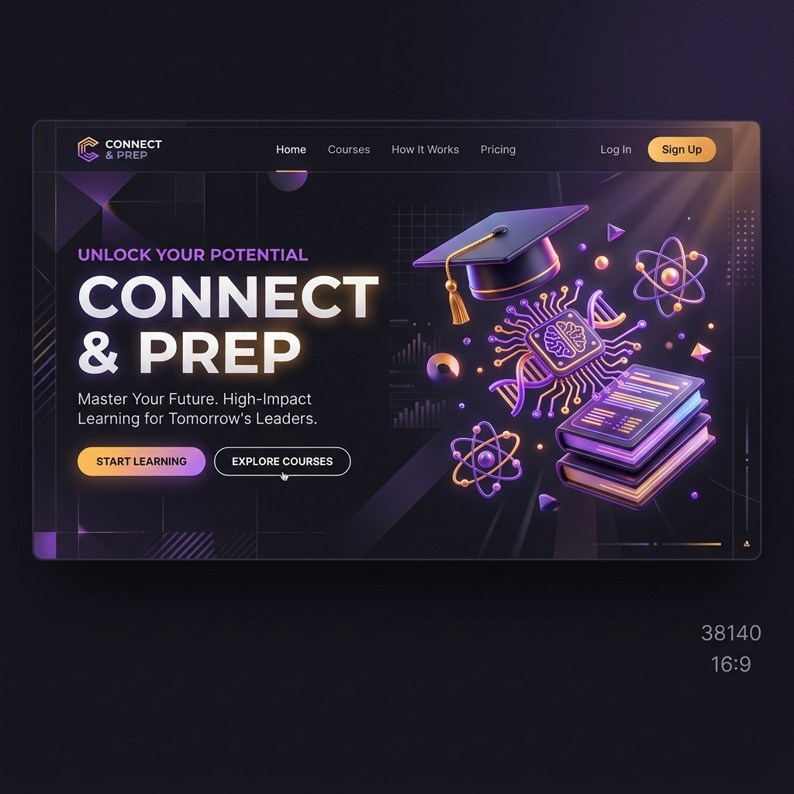
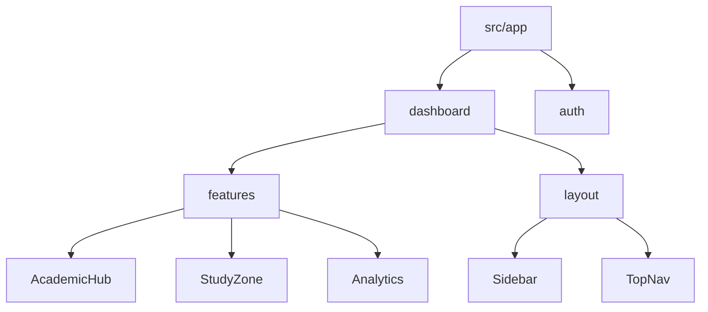

<div align="center">

# 🗺️ CONNECT & PREP
### *Master the Academic Nexus with AI-Powered Intelligence*



<p align="center">
  
  
  
  
</p>

---

### [✨ Core Features](#-a-universe-of-features) • [🛠️ Tech Core](#-technical-ecosystem) • [🏁 Quick Start](#-getting-started) • [🏆 Achievements](#-awards--recognition)

</div>

---

## 💎 The Vision
**Connect & Prep** is a premium, high-performance academic command center designed to bridge the gap between fragmented study materials and collaborative student excellence. Built with a **Neo-Brutalist** aesthetic, it provides a high-fidelity interface for the next generation of engineers and scholars.

> [!IMPORTANT]
> This platform has been recently migrated to **Next.js 14 (App Router)** for superior performance, SEO, and server-side capabilities.

---

## 🛠️ Technical Ecosystem

| Layer | Technology | Purpose |
| :--- | :--- | :--- |
| **Framework** | **Next.js 14** | Core engine & routing |
| **UI Library** | **React 18** | Component-based interface |
| **Icons** | **Lucide React** | High-fidelity vector iconography |
| **Visualizations** | **Recharts** | AI performance analytics & trends |
| **Styling** | **Custom CSS** | Neo-Brutalist design system |
| **Deployment** | **Vercel** | Edge-optimized hosting |

---

## 🏛️ A Universe of Features

Connect & Prep is packed with over **30+ integrated modules**, each serving as a specialized node in your academic journey.

### ⚡ Academic Command Center
| Feature | Description | Status |
| :--- | :--- | :---: |
| **AI Roadmap** | Generates personalized study paths based on performance. | ✅ |
| **Question Vault** | Multi-year repository of institutional exam papers. | ✅ |
| **Smart Notes** | Peer-verified, high-fidelity study materials. | ✅ |
| **Exam Predictor** | AI-driven forecasting of potential exam topics. | ✅ |
| **CGPA Terminal** | Visual grade forecasting and tracking suite. | ✅ |

### 🤝 Peer Collaboration Node
| Module | Capability |
| :--- | :--- |
| **Discussion Forum** | Real-time topic-based technical exchange. |
| **Doubt Solving** | Instant peer assistance for complex queries. |
| **Study Marathons** | Synchronized deep-work sessions with fellow students. |
| **Anonymous Box** | Secure, unbiased feedback and interaction channel. |
| **Interactive Board** | Shared visual concept mapping and sketching. |

---

## 📂 Project Architecture



---

## 🏁 Getting Started

### 1. Initialize Node
```bash
git clone https://github.com/bharathkumar000/connect-and-prep-college.git
cd connect-and-prep-college
```

### 2. Install Dependencies
```bash
npm install
```

### 3. Launch Engine
```bash
npm run dev
```

---

## 🏆 Awards & Recognition
> [!TIP]
> **2nd Place Winner** at the State Level Hackathon *Parivarthan* (Vidyavardhaka College of Engineering). Recognized for innovative UI/UX and architectural stability.

---

<div align="center">

### 👨‍💻 Developed by **Bharath Kumara**
*Full Stack Developer | UI/UX Architect*

[](https://linkedin.com/in/bharathkumar000)
[](https://github.com/bharathkumar000)

*Crafted with precision for the global student community.*

</div>
